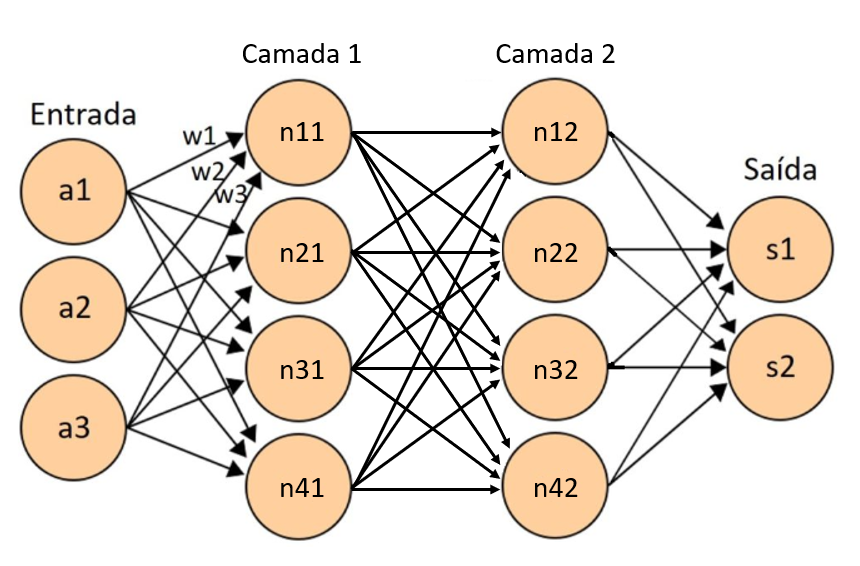

# Redes Neurais: O Cérebro da Máquina

Chega mais perto e vamos entrando no mundo das redes neurais! Vamos atravessar agora os corredores da inteligência artificial. Mas, o que são redes neurais? Não se preocupe, vou explicar isso de forma que até um neurônio ficaria orgulhoso!

## O que são Redes Neurais?

Imagine um mundo onde computadores podem pensar como seres humanos. Parece coisa de filme de ficção científica, certo? Mas é exatamente isso que as redes neurais fazem! Elas são o cérebro por trás da inteligência artificial, imitando o funcionamento do nosso próprio sistema nervoso.

## Como Funciona uma Rede Neural?

Vamos entrar na mente de uma rede neural! Ela é composta por neurônios artificiais, que são como pequenos assistentes cerebrais. Esses neurônios trabalham juntos em camadas para processar informações e aprender com elas. É como se cada neurônio fosse um músico em uma orquestra, contribuindo para a harmonia do conjunto.

## Aprendizado de Máquina: A Magia por Trás das Redes Neurais

Agora, aqui está a parte realmente incrível: o aprendizado de máquina! As redes neurais não nascem sabendo tudo, assim como nós. Elas precisam treinar e praticar para melhorar. É como ensinar truques a um cachorrinho - quanto mais você ensina, mais esperto ele fica!

## Aplicações das Redes Neurais

As redes neurais têm aplicações em diversos campos, desde reconhecimento de padrões até jogos de vídeo game. Elas podem até mesmo prever o futuro (pelo menos tentam)!

Então, da próxima vez que ouvir alguém falar sobre inteligência artificial, lembre-se: é apenas o trabalho árduo dos neurônios artificiais, fazendo o seu melhor para tornar o mundo um lugar mais inteligente e divertido!

